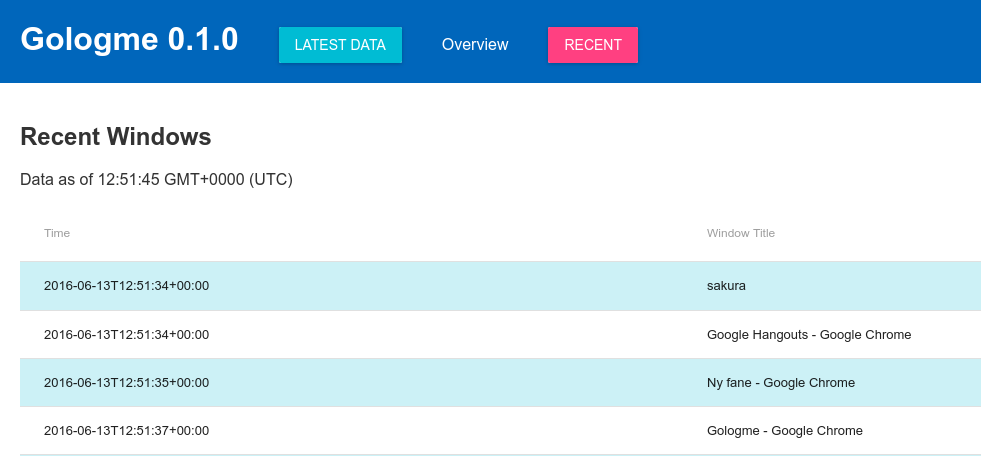

# gologme

[Ulogme](https://github.com/karpathy/ulogme) is awesomesauce, but there are some not so great things. Namely
that I have to set it up on a bunch of computers and it requires multiple
tools running in the background and they don't always exit as cleanly as
they should. That and I can't compile logs in a single place. This is even
worse when considering android in the mix.

And mostly I want to practice golang more :)

Snazzy new web UI (WIP), included in both the client + server components.

## Goals

- [x] Feature parity with ulogme (for the subset which I care about)
    - [x] Window Logging
    - [x] Key Logging
    - [ ] Mouse Logging
    - [x] Notes
    - [x] Blog
    - [x] lockscreen detection
        - [x] xscreensaver
        - [ ] ...
    - [ ] cross platform logging
      - https://github.com/kavu/AyeAye/ maybe
      - PRs welcome since I don't have a mac.
- [ ] Web UI
    - [ ] Skeleton
    - [x] Recent logs
    - [ ] Overview page
    - [ ] Day pages
- [x] Ulogme import/export. Near perfect roundtripping
- [ ] Android client
- [ ] multi-user support (Why? Who knows. Seems easy to tack on)
- [x] standalone mode (in opposition to client/server)
- [x] no sudo required!

## TODO

- [ ] TLS for server-connection [valyala/gorpc](https://github.com/valyala/gorpc)
- [ ] Sexy angularjs website
- [ ] docker image, since standalone mode + /dev/input mounts are really all that's required
- [ ] AF_UNIX instead of lo internet socket?
- [ ] ensure network connections are closed promptly
- [ ] cute cli graphs to document logging progress

## LICENSE

AGPLv3
